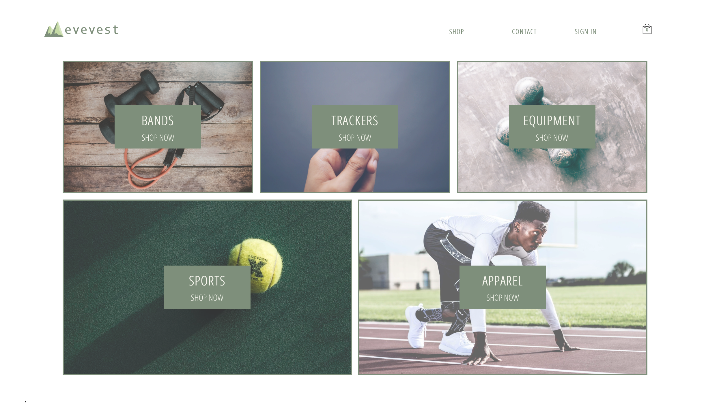

**Deployed at:** https://everest-fitness.herokuapp.com/

**Note:** Because it is deployed on heroku on a free plan, if the website was not accessed recently, it might take some time to load.

## Everest Description
An e-commerce fitness website, built using React, Redux, Firebase, Mailchimp, and integrated with Stripe payment. It features a home page, contact us page, shop page, login/logout page, and a checkout page.

## What I learned
This project gave me the experience of building a larger web application, requiring a lot of perserverance and patience. It gave me a lot of experience working with Redux as a state management system and helped me understand the benefits of using React as a front-end framework. Through this experience, I also had the opportunity to learn about Firebase and how it can be integrated with a frontend framework to build a powerful application.

## What is next for Everest
I will be looking forward to improving this project using React Hooks and Redux Sagas. It will give me the opportunity to delve into more advanced topics, regarding React and Redux.